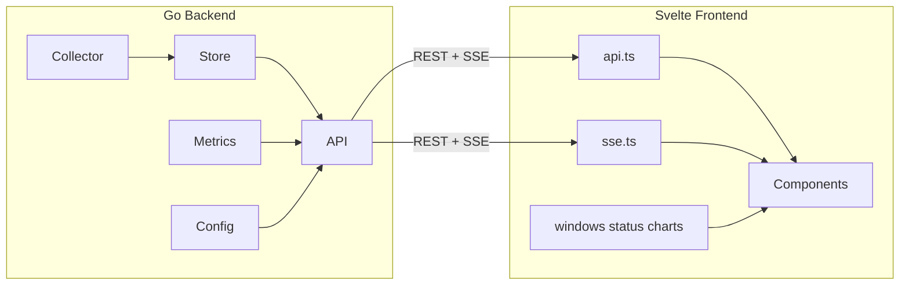

# Architecture

Network Monitor is a single-binary Go application: ping collector, SQLite persistence, REST + SSE API, and an embedded Svelte SPA. One process serves everything — no separate frontend server in production.

## Package layout and data flow

```
cmd/monitor/          Entrypoint: config, store, collector, HTTP server
internal/collector/   Cross-platform ping loop, jitter, retention prune
internal/store/       SQLite I/O, schema
internal/metrics/     Aggregations, status tier classification
internal/config/      YAML load/validate, runtime updates
internal/api/         HTTP routing, handlers, SSE hub, embedded SPA
web/                  Vite + Svelte 5 + uPlot dashboard
```



**Runtime path**

1. `collector` pings the configured target on an interval, computes jitter, writes `store.Sample` rows, and prunes by retention.
2. Each new sample is broadcast on SSE (`sample` event) and available via REST queries.
3. `api` handlers read from `store`, delegate aggregation to `metrics`, and return JSON.
4. The embedded SPA fetches history over REST and receives live updates over SSE.

| Layer | Responsibility | Do not |
|-------|----------------|--------|
| `internal/collector` | Ping loop, sample creation, retention prune | Query HTTP, render UI |
| `internal/store` | SQLite I/O, schema | Business rules (status tiers) |
| `internal/metrics` | Aggregations, status tiers | HTTP or DB details |
| `internal/api` | HTTP routing, auth, JSON, SSE | Ping parsing, SQL |
| `web/src/lib` | API client, pure helpers | Direct DOM or chart rendering |
| `web/src/components` | UI only | Fetch logic or metric math |

## API contract

Go structs (with `json` tags) in `internal/config`, `internal/store`, and `internal/metrics` are mirrored in `web/src/lib/api.ts`. Changes must update both sides in the same PR.

### REST endpoints

| Method | Path | Handler | Response / notes |
|--------|------|---------|------------------|
| `GET` | `/api/health` | `Health` | `{ ok: bool, uptime_s: int }` |
| `GET` | `/api/config` | `GetConfig` | `AppConfig` — target, intervals, thresholds, `window_options_minutes`, `live_window_seconds` |
| `PUT` | `/api/config` | `PutConfig` | Body: partial `{ target?, ping_interval_seconds?, retention_minutes? }`. Returns updated fields. Token required when not localhost. |
| `GET` | `/api/summary?minutes=` | `Summary` | `Summary` — window aggregates and `status` tier (`great` \| `ok` \| `poor` \| `offline`) |
| `GET` | `/api/samples?minutes=` | `Samples` | `{ buckets: ChartBucket[], window_minutes: int, bucket_seconds: float }` — epoch-aligned time buckets; `bucket_seconds` tier-derived from window (~300 points) |
| `GET` | `/api/live` | `Live` | `LiveMetrics` — rolling 60s window |

**Query param `minutes`** — Shared by summary and samples. Defaults to 30 (capped by retention). Bounded to `[1, retention_minutes]`.

**Config write auth** — Loopback hosts allowed without token. Otherwise requires `CONFIG_TOKEN` env via `Authorization: Bearer …` or `X-Config-Token`.

### SSE (`GET /api/events`)

Envelope for every event: `{ "type": string, "data": object }`.

| Event `type` | `data` shape | Source |
|--------------|--------------|--------|
| `connected` | `{}` | Sent on connect |
| `sample` | `Sample` | Each ping result from collector |
| `config` | `{ target, ping_interval_seconds, retention_minutes }` | After successful `PUT /api/config` |

Client parsing and reconnect with exponential backoff live in `web/src/lib/sse.ts` — do not duplicate reconnect logic in components.

### Shared types

| Type | Go | TypeScript |
|------|-----|------------|
| `Thresholds` | `config.Thresholds` | `Thresholds` |
| `AppConfig` | composed in `GetConfig` | `AppConfig` |
| `Sample` | `store.Sample` | `Sample` |
| `Summary` | `metrics.Summary` | `Summary` |
| `LiveMetrics` | `metrics.LiveMetrics` | `LiveMetrics` |
| `ChartBucket` | `metrics.ChartBucket` | `ChartBucket` |

Status tiers: Go `metrics.StatusTier` and TS `"great" | "ok" | "poor" | "offline"` must stay aligned. Classification logic belongs in Go `metrics.ClassifyStatus`; frontend display helpers in `web/src/lib/status.ts`.

## Build and embed pipeline

Production ships one binary with the dashboard embedded.

```
web/  →  npm run build  →  web/dist/
web/dist/  →  npm run sync-web  →  internal/api/dist/
internal/api/dist/  →  //go:embed all:dist  →  compiled into monitor binary
```

Root `package.json` scripts:

- `npm run build` — `web:build` + `sync-web` + `go build`
- `npm test` — `test:go` + `test:unit` + `pretest:e2e` (build) + `test:e2e`

`internal/api/server.go` serves `dist/` as static files with SPA fallback (`index.html` for unknown routes). API routes under `/api/` are registered before the file server.

**Dev mode** — Double-click `dev.bat` or run `npm run dev` from the repo root (starts Go API and Vite, opens `:5173`). Manual workflow: `go run ./cmd/monitor` and `cd web && npm run dev`. Vite proxies `/api` to `:8080`; no embed rebuild needed per UI change.

## Frontend styling

CSS lives under `web/src/styles/`:

- `tokens/` — palette primitives, semantic aliases, theme files (`dark.css`; `light.css` stub not imported yet)
- `layers/` — reset, base typography, **layout modes** (`layout.css`), shared component rules
- `index.css` — `@layer` declaration and ordered imports (entry from `main.ts`)

Layout modes (vertical / normal / ultrawide) are centralized in `layers/layout.css` via container queries on `.page`. Components consume `--layout-*` tokens rather than defining their own breakpoints. See `.cursor/rules/styling.mdc`.

Component layout stays in scoped `<style>` blocks; promote to `layers/components.css` only when reused.

## Schema and migrations

Source of truth: `internal/store/schema.sql` (embedded via `//go:embed`).

Current schema:

- `samples` table: `id`, `ts`, `host`, `success`, `latency_ms`, `jitter_ms`
- WAL journal mode, index on `ts`

**Policy — forward-only**

1. Update `schema.sql` for new installs.
2. Add migration logic in `store.Open` for existing databases (e.g. `ALTER TABLE` guarded by a `schema_version` pragma or table).
3. Add a store test that opens an old-schema fixture and verifies migration.

Today `store.Open` runs `schema.sql` with `CREATE TABLE IF NOT EXISTS` only — no versioned migrations yet. Any column or table change must introduce explicit migration steps; never edit production DBs by hand.

## Testing strategy

| Layer | Tool | Location |
|-------|------|----------|
| Ping parsing, jitter | Go unit | `internal/collector/*_test.go` |
| Store queries, retention | Go + temp DB | `internal/store/store_test.go` |
| Metrics, status tiers | Go unit | `internal/metrics/*_test.go` |
| HTTP handlers, auth | `httptest` | `internal/api/handlers_test.go` |
| Pure TS helpers | Vitest | `web/src/lib/*.test.ts` |
| Dashboard flows | Playwright | `tests/e2e/` |

Run all layers: `npm test` from the repo root.

Add regression tests when fixing bugs. Skip tests that only assert mocks or trivial wiring.

## Extension points

### New metric window or dashboard panel

1. Add binding to `DASHBOARD_METRICS` in `web/src/lib/windows.ts`.
2. Wire props/state in `App.svelte`; build UI in a component under `web/src/components/`.
3. If the panel needs new aggregates, add computation in `internal/metrics` and expose via a new or existing REST endpoint.

### New REST endpoint

1. Add handler in `internal/api/handlers.go`, route in `internal/api/server.go`.
2. Mirror types and client function in `web/src/lib/api.ts`.
3. Add `httptest` coverage in `handlers_test.go`.
4. Document in README API table.

### New SSE event type

1. Broadcast via `sse.Broadcast(type, data)` from the appropriate backend location.
2. Handle the `type` in the SSE handler callback in `App.svelte` (or a dedicated lib helper).
3. Keep the `{ type, data }` envelope — do not introduce a second format.

### New chart or visualization

1. Read [DATA_VISUALIZATION.md](DATA_VISUALIZATION.md) — fixed time buckets (~300 points), avg + per-bucket range band for latency.
2. Use uPlot via helpers in `web/src/lib/charts.ts`.
3. Fetch data through `api.ts`; filter with `windows.ts`, `time.ts`, or aggregate in `charts.ts` pure functions.
4. Mirror `ChartBucket` (or new shapes) in Go and `api.ts`.
5. Do not call `fetch` from components.

### Schema change

Follow the migration policy above. Update `Sample` struct in Go and `api.ts` if the shape changes.

### New dependency

Justify in the PR. Prefer stdlib and existing patterns (Svelte runes, pure functions) over frameworks, ORMs, or global state libraries.
