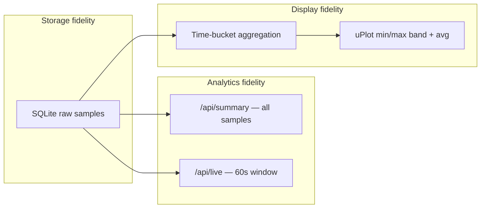

# Data Visualization Guidelines

How Network Monitor presents network quality data: readable at every window size (5–180 min), faithful to spikes and outages, and consistent with layer boundaries and design tokens.

See also [ARCHITECTURE.md](ARCHITECTURE.md) for package layout and [CONTRIBUTING.md](../CONTRIBUTING.md) for the PR checklist.

## Principles



| Principle | Rule |
|-----------|------|
| **Store everything** | SQLite keeps every ping at collector interval. Never delete resolution at the source. |
| **Analyze on full data** | Summary, status tiers, and live metrics use all samples in scope (`internal/metrics/summary.go`). |
| **Display at window tier** | Charts target ~300 buckets per rolling window (same density as 5 min @ 1 Hz raw). Aggregate for display only. |
| **Preserve spread within buckets** | Per-bucket **min** and **max** show spread inside each time slice; not uniform index sampling. |
| **Separate roles** | Cards show aggregates; charts show shape over time; live panel shows fixed 60 s rolling averages. |
| **Temporal stability** | History stays fixed on the time axis; only the viewport scrolls. See [Temporal stability](#temporal-stability) below. |

## Temporal stability

Monitor-grade charts must not reshuffle or re-average history on every tick. Users expect a spike at 10:42 to remain at 10:42.

| Rule | Rationale |
|------|-----------|
| **Epoch-aligned bins** | Bin identity = `floor(ts / bucketSeconds) * bucketSeconds`. Never assign bins relative to a sliding `windowStart`. |
| **Absolute timestamps** | Bucket `ts` is the bin center on the real time axis. History does not move when the viewport scrolls. |
| **Viewport ≠ data** | Rolling viewport scrolls with chart refresh only. Data changes when a completed bucket is finalized, the window changes, or SSE reconnects. |
| **Incremental live updates** | Merge SSE samples into an open bin; finalize into `completed` when the next bin starts. Trim bins older than the window. |
| **Re-aggregate only when needed** | Full fetch: bootstrap, window change, SSE reconnect. Never on a status clock tick or chart resize. |
| **One merge algorithm** | Go and TS use identical rules: min of mins, max of maxes, count-weighted avg. Same epoch bin key formula in both layers. |

## Time windows and metric scopes

Align with `web/src/lib/windows.ts`:

| Binding | Scope | Window source |
|---------|-------|---------------|
| `connection` | rolling | User dropdown (5/15/30/60/120 min) |
| `latencyChart` | rolling | User dropdown |
| `live` | fixed | Always 60 s (`LIVE_WINDOW_SECONDS`) |

- Rolling charts use X-axis `[viewport − window, viewport]` via `xScaleBounds` in `charts.ts`. `viewport` advances only on chart refresh (bin finalized, bootstrap, window change, reconnect).
- Window changes re-fetch server data (`getSummary`, `getChartBuckets`) and hydrate the client buffer (`hydrateChartBuffer` in `charts.ts`).
- SSE `sample` events merge into the open bin via `ingestSample`; chart refreshes only when a bin is finalized (first sample of the next epoch bin). Full chart refetch is for bootstrap, window change, and reconnect only.
- The status pill uses a 1 Hz clock for stale/offline detection only; it does not drive the chart.
- **Rule:** Never mix rolling and fixed semantics in the same visualization without stating it in the title.

## Chart data resolution

Charts use **fixed time-bucket aggregation** per rolling window, not pixel-width adaptation or uniform index downsampling.

### Bucket sizing (300-point baseline)

5 min @ 1 Hz (~300 points) is the density baseline. All windows use the same formula to keep ~300 buckets.

```
bucketSeconds = (windowMinutes × 60) / 300
binStart      = floor(ts / bucketSeconds) × bucketSeconds
binCenter     = binStart + bucketSeconds / 2
```

| Window | `bucket_seconds` | ~Buckets |
|--------|------------------|----------|
| 5 min | 1 | 300 |
| 15 min | 3 | 300 |
| 30 min | 6 | 300 |
| 60 min | 12 | 300 |
| 120 min | 24 | 300 |
| 180 min | 36 | 300 |

Go: `metrics.DisplayBucketSeconds`. TypeScript: `displayBucketSeconds` in `web/src/lib/windows.ts`. Both must stay in sync.

- Bins are **epoch-aligned** (anchored to Unix time), not relative to a sliding window start.
- All pings whose timestamp falls in `[binStart, binStart + bucketSeconds)` contribute to one bucket's avg/min/max.

### Per-bucket fields

| Field | JSON | Use |
|-------|------|-----|
| Timestamp | `ts` | **Bucket center** (RFC3339 UTC) |
| Average | `avg_ms` | Primary line series |
| Minimum | `min_ms` | Range band lower bound |
| Maximum | `max_ms` | Range band upper bound |
| Count | `sample_count` | Weighted merge on SSE append |

Failed pings are excluded from min/max/avg. If an entire bucket has no successful pings, emit `null` for all three latency fields.

### Layer placement

| Step | Location |
|------|----------|
| Tier lookup | `internal/metrics/buckets.go` — `DisplayBucketSeconds`; `web/src/lib/windows.ts` — `displayBucketSeconds` |
| Server aggregation | `internal/metrics/buckets.go` — `AggregateBuckets` |
| HTTP response | `internal/api/handlers.go` — `Samples` handler |
| Client buffer + SSE ingest | `web/src/lib/charts.ts` — `ChartBuffer`, `ingestSample`, `displayBuckets`, `hydrateChartBuffer` |
| uPlot config + range bands | `web/src/lib/charts.ts` — `createLatencyChart` |
| DOM mount / resize | `web/src/components/LatencyChart.svelte` |

**Rule:** Components do not aggregate. Pure functions in `charts.ts` / `metrics` only.

### API contract

`GET /api/samples?minutes=` returns:

```json
{
  "buckets": [
    { "ts": "…", "avg_ms": 42.5, "min_ms": 38.0, "max_ms": 51.0, "sample_count": 9 }
  ],
  "window_minutes": 30,
  "bucket_seconds": 6
}
```

`bucket_seconds` is tier-derived from `window_minutes` via `DisplayBucketSeconds`. The client uses this for SSE merges (`ingestSample`); it does not re-bucket on resize. API bootstrap strips the trailing open bin; live display shows completed bins only.

Types: `metrics.ChartBucket` (Go) and `ChartBucket` in `web/src/lib/api.ts`. Update both in the same PR.

### Legacy note

Uniform index sampling (the former `store.Downsample`) was removed. Do not reintroduce that pattern for time-series display.

## uPlot rendering standards

### Latency chart (default)

Mandated style: **average line + per-bucket min/max range band**.

| Element | Data | Style |
|---------|------|-------|
| Range band | `min_ms`, `max_ms` per bucket | Vertical filled rect at each bucket center (`--color-chart-envelope-fill`); subtle min/max cap strokes (`--color-chart-envelope`). **Do not** connect max or min values across buckets as line series. |
| Primary | `avg_ms` | `--color-accent` stroke, width 2, connected line |

Other rules:

- `spanGaps: true` on the average series — do not interpolate across failed pings.
- X-axis: time scale with rolling bounds from `xScaleBounds`.
- Y-axis: label `ms`; range includes min/max band values; starts at 0 when sensible.
- On chart refresh: `setScale` and `setData` together via `updateLatencyChart`.
- On resize: `setSize` only — no re-bucketing.
- On SSE sample: merge into open bin; refresh chart only when a bin is finalized (next bin starts).

### Theme integration

Read all chart colors and height from `chartTheme()` in `web/src/lib/theme.ts`. Required semantic tokens:

| Token | Purpose |
|-------|---------|
| `--color-chart-envelope` | Min/max line stroke |
| `--color-chart-envelope-fill` | Fill between min and max |
| `--color-accent` | Average line (existing) |
| `--color-text-muted` | Axis stroke (existing) |
| `--chart-height` | Chart height (existing) |

Define tokens in `web/src/styles/tokens/semantic.css`. Override in theme files when light mode ships.

## Non-chart visualizations

### Status card

- Window aggregate tier + avg latency + loss %.
- Status color via `data-status` + `--color-status-*` tokens. Do not use chart accent for tier semantics.
- Per-stat left accent via `data-quality` on each stat row (`latencyQuality`, `lossQuality` in `status.ts`); same indicator style as live metrics.
- Missing values: em dash (`—`) via `formatMs` / inline equivalent.

### Live metrics

- Fixed 60 s scope; rolling averages over all samples in the window (latency and jitter from successful pings only; loss over all pings).
- Refreshes on every ping via `GET /api/live` (triggered from SSE `sample` events).
- Scalars: avg latency, avg jitter, packet loss; in vertical and ultrawide layouts the live card also shows min/max latency, min/max jitter, and lost packet count. No sparklines unless this doc is extended.
- Per-metric left accent via `data-quality` on each metric tile (primary values only; min/max detail rows stay neutral).

### Number formatting

| Type | Format | Helper |
|------|--------|--------|
| Latency / jitter | 1 decimal + ` ms` | `formatMs` |
| Loss | 1 decimal + `%` | `formatPercent` |
| Null / no data | `—` | shared convention |

One decimal place for dashboard scalars unless scientifically required.

## Color and accessibility

- Chart data ink: `--color-accent` for the average line only.
- Status semantics: tier tokens on status UI only, not chart lines.
- Envelope fill must remain visible in dark and light themes.
- Chart updates on SSE are fine; avoid animated scale jumps.

## Testing

| Layer | What to test |
|-------|----------------|
| Go `metrics` | `DisplayBucketSeconds`, epoch bin alignment, min/max/avg, all-fail bucket → nulls, stability when `windowStart` shifts |
| TS `charts.ts` | `ingestSample`, `displayBuckets`, `hydrateChartBuffer`, `buildLatencySeries` |
| Handlers | `/api/samples` returns `buckets` for the requested window |
| Playwright | Chart container present; window label updates (existing `dashboard.spec.ts`) |

Every aggregation function gets deterministic tests with fixed timestamps (pattern from `windows.test.ts`).

## Anti-patterns

Do **not**:

- Plot raw 1 Hz data for 60+ min windows without bucketing.
- Connect bucket max/min values as line series (causes spike artifacts).
- Derive bucket width from chart pixel width.
- Use uniform index downsampling for time series.
- Compute aggregates in Svelte components.
- Hardcode chart colors or heights.
- Use chart line color to imply status tier.
- Interpolate lines through packet-loss gaps.
- Duplicate different aggregation algorithms in Go and TypeScript.
- Sliding-window-relative bin indices (`elapsed / bucketSeconds` from `windowStart`).
- Re-bucketing or chart refresh on a timer without new completed bucket data.
- Full-window chart refetch on every SSE sample.
- Recomputing bucket center timestamps from `now` on each render.

## Extension checklist

### New chart

1. Read this doc.
2. Add helpers in `web/src/lib/charts.ts` (uPlot config + pure aggregation).
3. Fetch through `api.ts`; add Go types and handler if new data is needed.
4. Mount in a component under `web/src/components/` — DOM only, no `fetch`.
5. Add Vitest coverage for pure functions; Go tests for server aggregation.

### New scalar panel

1. Add binding in `web/src/lib/windows.ts` if window-scoped.
2. Add computation in `internal/metrics` if not covered by summary/live.
3. Use `formatMs` / `formatPercent` for display.
